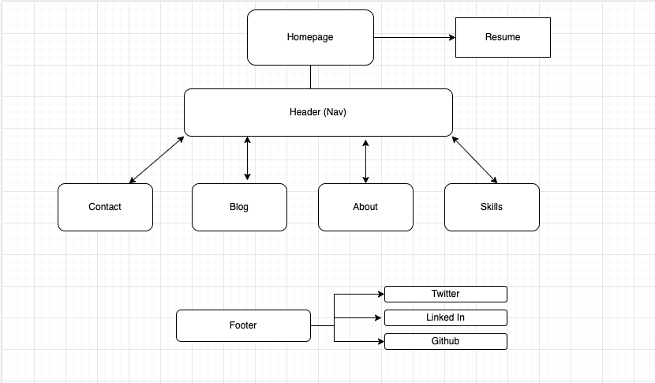
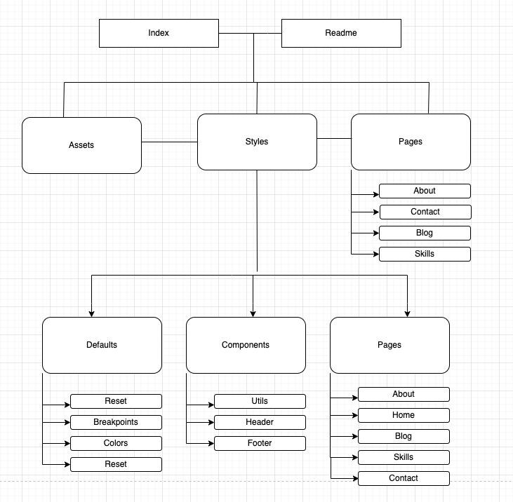
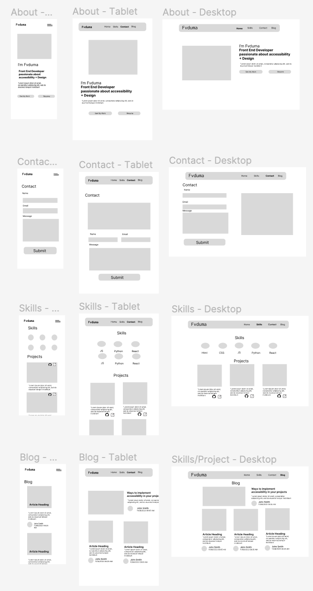
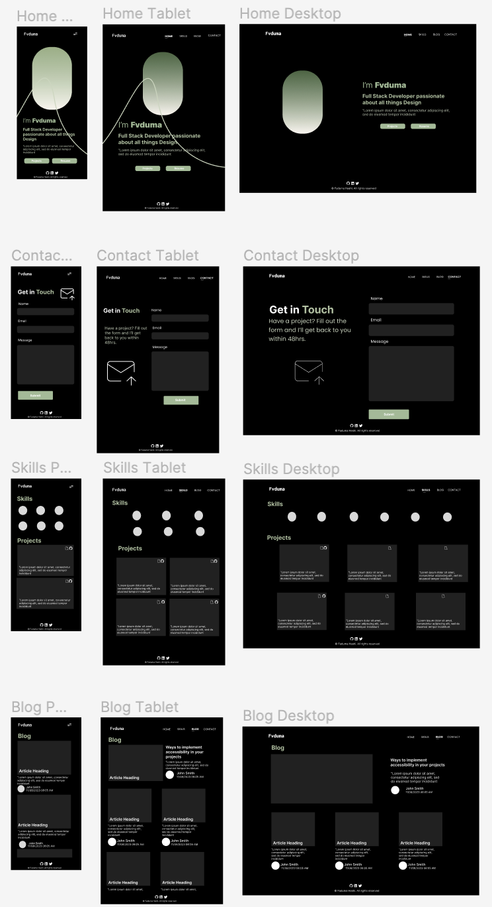
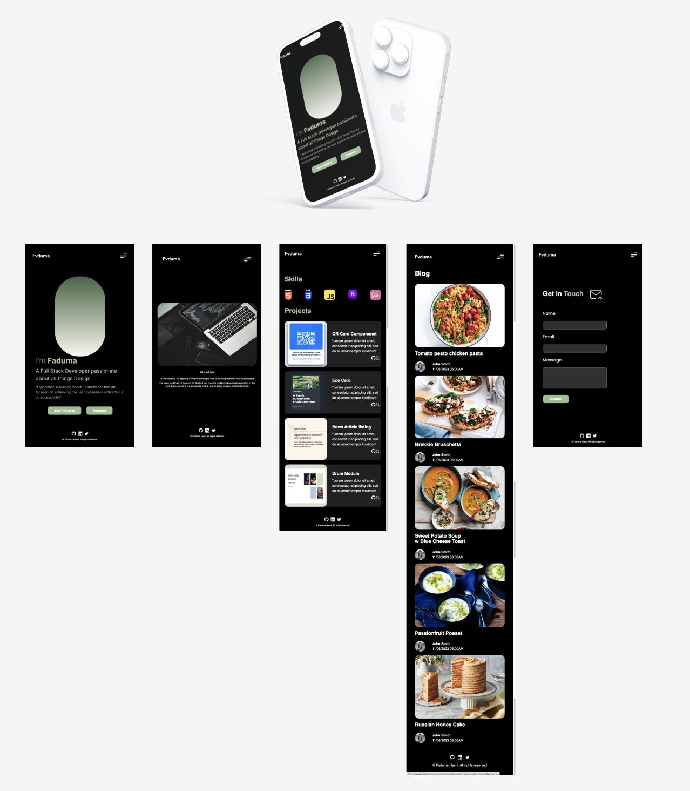
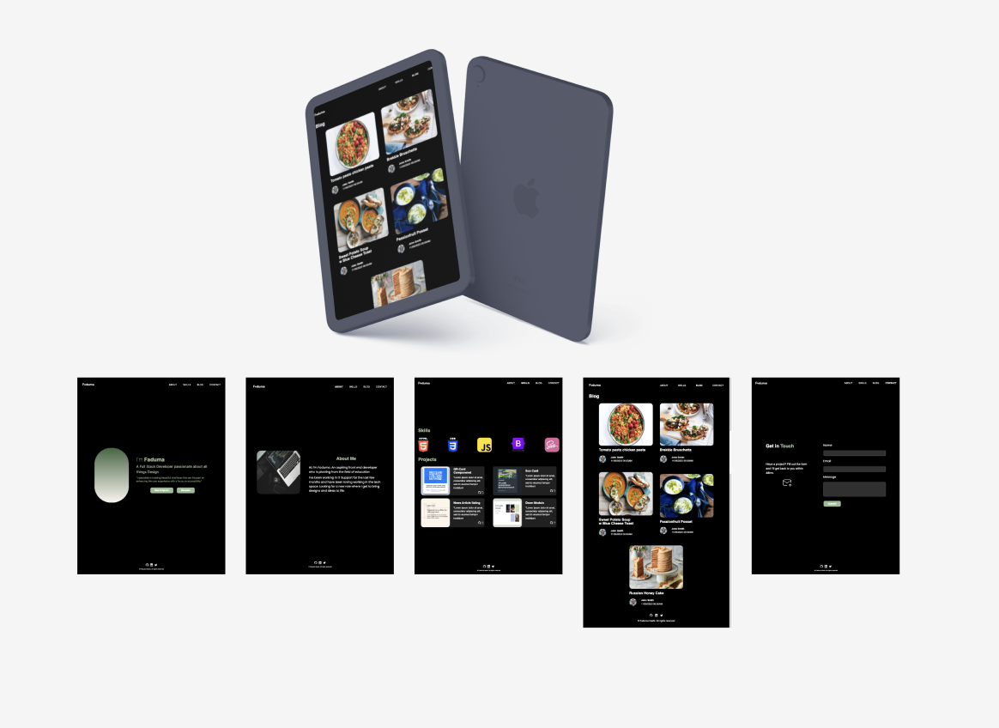
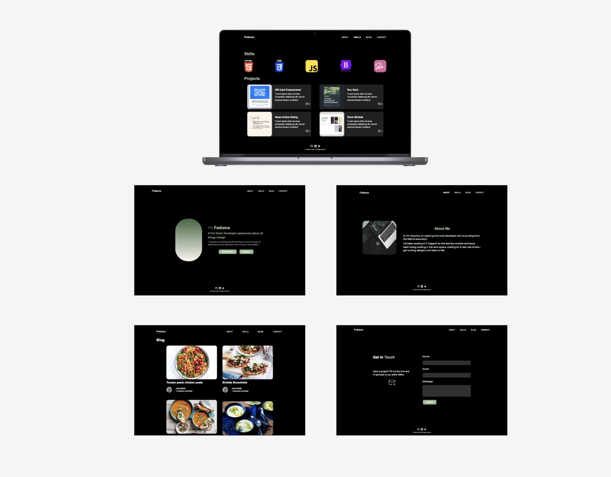

# Faduma Hashi T1A2 Portfolio Assignment [Coder Academy]

Hi,
Welcome to my portfolio.
The purpose of this website is to showcase my abilities to **future employers**.
<br>
A lot of care has been put into this from the design to trying to get the code as accurate to the wireframes as possible.  
It's a simple responsive website that will be continously worked on as I get more experience under my belt.

### Links

- [GitHub Repo](https://github.com/fvduma/Portfolio)
- [Live Site](https://melodic-brigadeiros-761300.netlify.app/)

## Table of contents

- [Published Portfolio Website](https://melodic-brigadeiros-761300.netlify.app/)
- [Github Repo](https://github.com/fvduma/Portfolio)
- [Presentation]()
- [Functionality & Features](#functionality--features)
  - [Home](#home-page)
  - [About](#about-page)
  - [Skills](skills-page)
  - [Blog](#blog-page)
  - [Contact](#contact-page)
- [Site Map](#site-map)
- [Wireframes](#wireframes)
  - [Low Fidelity](#low-fidelity)
  - [High-Fidelity](#high-fidelity)
- [Screenshots](#screenshot)
- [Built with](#built-with)
- [Continued development](#continued-development)

## Functionality & Features

### Home Page

The Home Page is the landing page and has a nice simple headline of who I am and what I do and:

- Showcases my projects through my call to action (button)
- Showcases my resume
- It contains a clear and visible navigation which allows my viewers to clearly find what they're looking for
- The Navigation also uses minimal javascript to transform into a hamburger menu for mobile users
- The Footer allows people to see my social media presence on work-related websites

### About Page

My About Page showcases my motivation and interest in coding and web developement.  
It also advises of my previous work history and contains a hero image of a coding workspace.

### Skills Page

The Skills Page consists of a few graphical components. <br>

1. Icons of the tech stacks I have used and have experience with
2. Card Components with Image of my Projects
3. Icons that link to the repo and live site of each Project
4. Footer which has social media links attached to each icon.

### Blog Page

The Blog Page contains links imbedded into the each image which will take you directly to the recipe.
It showcases the author with their profile picture and the time that the article was created.

Each Blog article contains

- Link to recipe
- Image of Recipe
- Author
- Date Recipe Created
- Title of Recope

### Contact Page

The Contact Page contains a simple form with the inputs of:

- Name
- Email (Validated)
- Text Area (for Message)
- Submit

### Site Map



- Navigation - From any page you can access the HomePage, Contact, Blog, About, Skills
- Footer - In the future you have access to external social links and can acess my LinkedIn, Github & Twitter



This is the directory of my code.  
From the root file, I have my index.html, and readme.  
Styles contain all my stylesheets and in future I will try to define consistent font-families and styles and add it to another stylesheet.

### Wireframes

## Low Fidelity



## High Fidelity



## Screenshot

### Mobile



### Tablet



### Desktop



### Built with

- Semantic HTML5 markup
- CSS custom properties
- Flexbox
- CSS Grid
- Mobile-first workflow
- SASS
- Javascript
- Depoloyed with Netlify

### Continued development

I would like to practice with SASS more as I felt I struggled with the linking of each page and partial.  
It felt like each time I needed to link something I broke something, but I do feel more confident after this project.
I also would like to use the nesting feature more as it makes the code more succint however I kept forgetting to utilise it in this project.
Here is a mini code snippet of how I used SCSS

```css
@import "styles/defaults/reset";
@import "styles/defaults/breakpoints";
@import "styles/defaults/colors";
@import "styles/components/footer";
@import "styles/components/header";
@import "styles/defaults/buttons";
```

I did also use some javascript which I am proud of

```js
<script>
  document.querySelector('.menu-btn').addEventListener('click', () =>{" "}
  {document.querySelector("nav").classList.toggle("open")})
  document.querySelector('.close-btn').addEventListener('click', () =>{" "}
  {document.querySelector("nav").classList.toggle("open")})
</script>
```
